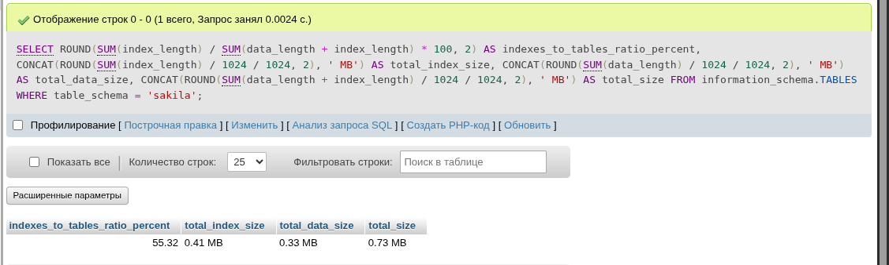
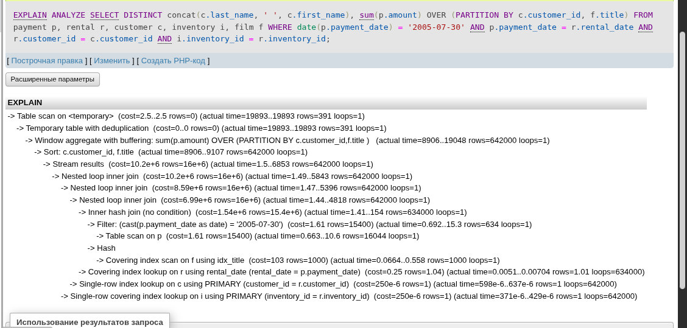
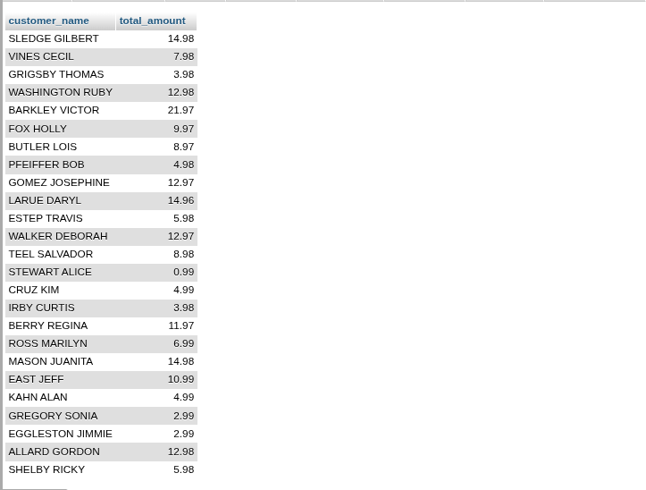

# Домашнее задание к занятию «Индексы» - Малявко Сергей (netology)

Задание можно выполнить как в любом IDE, так и в командной строке.

### Задание 1
Напишите запрос к учебной базе данных, который вернёт процентное отношение общего размера всех индексов к общему размеру всех таблиц.

### Выполнение задания 1
```sql
SELECT 
    ROUND(SUM(index_length) / SUM(data_length + index_length) * 100, 2) AS indexes_to_tables_ratio_percent,
    CONCAT(ROUND(SUM(index_length) / 1024 / 1024, 2), ' MB') AS total_index_size,
    CONCAT(ROUND(SUM(data_length) / 1024 / 1024, 2), ' MB') AS total_data_size,
    CONCAT(ROUND(SUM(data_length + index_length) / 1024 / 1024, 2), ' MB') AS total_size
FROM 
    information_schema.TABLES
WHERE 
    table_schema = 'sakila';
```
##### Скриншот выполнения команды



### Задание 2
Выполните explain analyze следующего запроса:
```sql
select distinct concat(c.last_name, ' ', c.first_name), sum(p.amount) over (partition by c.customer_id, f.title)
from payment p, rental r, customer c, inventory i, film f
where date(p.payment_date) = '2005-07-30' and p.payment_date = r.rental_date and r.customer_id = c.customer_id and i.inventory_id = r.inventory_id
```
- перечислите узкие места;
- оптимизируйте запрос: внесите корректировки по использованию операторов, при необходимости добавьте индексы.

### Выполнение задания 2
** Узкие места: **
1) Использование DATE() в условии WHERE - функция DATE(p.payment_date) предотвращает использование индекса по payment_date
2) Декартово произведение таблиц - соединение через запятую без явных JOIN может привести к неоптимальному плану выполнения
3) Оконная функция с PARTITION BY - вычисление суммы по двум полям (customer_id и title) может быть избыточным
4) Отсутствие индексов - для соединений и фильтрации могут отсутствовать подходящие индексы
5) DISTINCT - может создавать дополнительную нагрузку при обработке результатов

##### Скриншот выполнения команды


** Оптимизированный запрос: **
```sql
-- Создаем индекс для фильтрации по дате (если его еще нет)
CREATE INDEX idx_payment_date ON payment(payment_date);

-- Оптимизированный запрос
SELECT 
    CONCAT(c.last_name, ' ', c.first_name) AS customer_name,
    SUM(p.amount) AS total_amount
FROM 
    payment p
    INNER JOIN rental r ON p.payment_date = r.rental_date
    INNER JOIN customer c ON r.customer_id = c.customer_id
    INNER JOIN inventory i ON r.inventory_id = i.inventory_id
    INNER JOIN film f ON i.film_id = f.film_id
WHERE 
    p.payment_date >= '2005-07-30' 
    AND p.payment_date < '2005-07-31'
GROUP BY 
    c.customer_id,
    c.last_name,
    c.first_name;
```

** Ключевые оптимизации: **
1) Замена DATE() на диапазон дат - позволяет использовать индекс по payment_date
2) Явные JOIN вместо декартова произведения - улучшает читаемость и помогает оптимизатору
3) GROUP BY вместо оконной функции - более эффективно для данной задачи
4) Удаление DISTINCT - избыточен при правильной группировке
5) Упрощение логики - если не нужна группировка по названию фильма, она удалена

##### Скриншот выполнения команды

